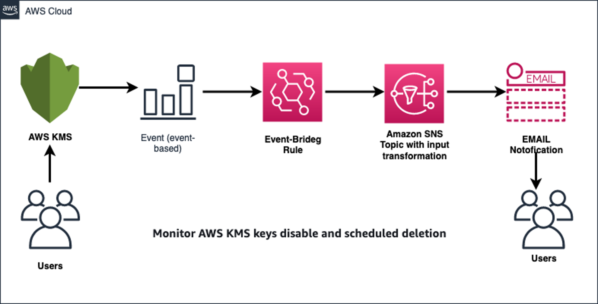

© 2023 Amazon Web Services, Inc. or its affiliates. All Rights Reserved. This work is licensed under a Creative Commons Attribution 4.0 International License.

# Monitor AWS KMS keys disable and scheduled deletion
## **Summary**

Deleting an AWS KMS key is destructive and potentially dangerous. It deletes the key material and all metadata associated with the KMS key and is irreversible. After a KMS key is deleted, you can no longer decrypt the data that was encrypted under that KMS key, which means that data becomes unrecoverable. 

This pattern explain the steps to monitor Amazon KMS key status by combining the features of AWS EventBridge and SNS notification that notifies you when a KMS key status is changed to disable and pending deletion.Post reciving the notification, you can reconsider your decision to delete it or enable the disabled KMS.key

## **Prerequisites**

An active AWS account with an AWS Identity and Access Management (IAM) user

Understanding of the following AWS services: 

- Amazon EventBridge

- EventBridge Input Transformer

- AWS KMS

- Amazon Simple Notification Service (Amazon SNS)

## **Target architecture**

- Deletion of an AWS KMS key is scheduled or KMS key got disabled by any user.

- The scheduled-deletion event is evaluated by an EventBridge rule.

- The EventBridge rule engages the Amazon SNS topic.

- An email notification is send to the user or group for further action.

## **Tools**

-   [Amazon EventBridge rules](https://docs.aws.amazon.com/eventbridge/latest/userguide/eb-rules.html) - A rule matches incoming events and sends them to targets for processing. A single rule can send an event to multiple targets, which then run in parallel. Rules are based either on an event pattern or a schedule.

-   [AWS CloudFormation](https://aws.amazon.com/cloudformation/) – AWS CloudFormation is an infrastructure as code (IaC) service that allows you to easily model, provision, and manage AWS and third-party resources.

- [AWS KMS] – AWS Key Management Service (AWS KMS) is a managed service for creating and controlling AWS KMS keys, the encryption keys used to encrypt your data.

- [Amazon SNS] – Amazon Simple Notification Service (Amazon SNS) is a managed service that provides message delivery from publishers to subscribers (also known as producers and consumers). Publishers communicate asynchronously with subscribers by sending messages to a topic, which is a logical access point and communication channel. 

## **Steps to Deploy**

1. Clone this repository to local workstation
2. Deploy Alerting-KMS-Events.yaml to the account where you want the deploye the solution.